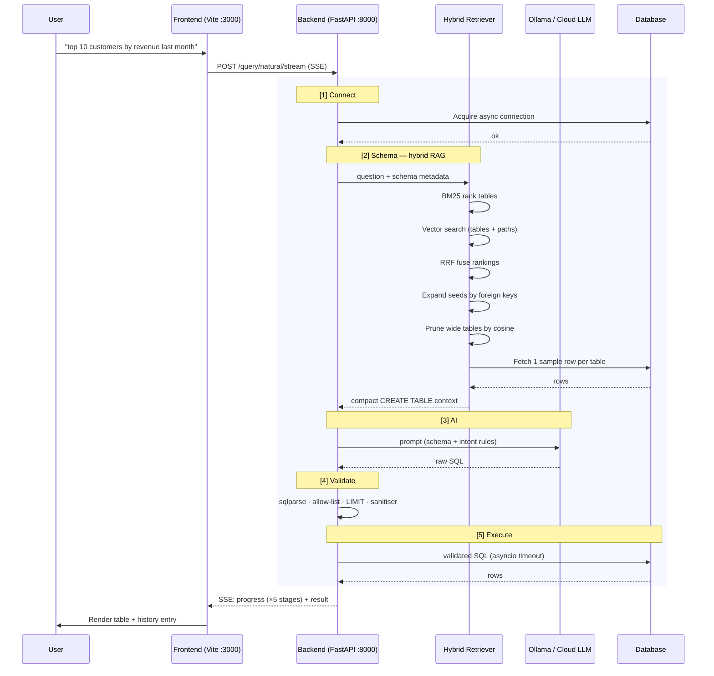

# Natural Language SQL Engine

> Ask your database questions in plain English. Get SQL and results instantly. Local Ollama by default, optional cloud model when you need one.

[](https://python.org)
[](https://fastapi.tiangolo.com)
[](https://react.dev)
[](LICENSE.txt)

---

## Download & Run

**Requires:** [Docker](https://www.docker.com/get-started) 20.10+ with Compose v2 · ~10 GB free disk · no Python/Node/Ollama needed.

**One-liner (macOS / Linux):**

```bash
curl -fsSL https://raw.githubusercontent.com/jmanoj0905/natural-language-sql/main/quickstart.sh | sh
```

**Or manually:**

```bash
curl -O https://raw.githubusercontent.com/jmanoj0905/natural-language-sql/main/docker-compose.yml
docker compose up -d
```

Open **http://localhost:3000**.

> **First run:** the Ollama model (~5 GB) downloads in the background. SQL generation becomes available once the download finishes. Watch progress with `docker compose logs -f ollama-pull`.

To pick a cloud provider (OpenAI, Gemini, Groq) instead of the local model, open the **Settings** panel in the app after it starts.

> Privacy: everything runs in local containers. With the default Local/Ollama provider, no data leaves your machine. (Note: with a cloud provider, your question and database schema are sent to that provider — see [PRIVACY.md](PRIVACY.md) for the full statement.)

---

## What it does

Type a question like *"show me the top 10 customers by revenue last month"* — the engine retrieves only the relevant slice of your schema, asks a local SQL-tuned LLM to write the query, validates it, executes it, and streams the results back in real time. No SQL knowledge required.

**Stack:** FastAPI + async SQLAlchemy · React 18 + Vite + Tailwind · Ollama / OpenAI / Gemini / Groq routing · BM25 + sentence-transformers hybrid retrieval

> Looking for the deep-dive blueprint (architecture, pipeline internals, file-to-responsibility map)? See [`PROJECT_BLUEPRINT.html`](./PROJECT_BLUEPRINT.html).
>
> Benchmark results (Spider dev, 52.32 % execution accuracy): [`BENCHMARKS.md`](./BENCHMARKS.md).

---

## Features

- **Local AI by default** — Ollama runs on your machine. OpenAI, Gemini, and Groq are opt-in per request from Settings; keys never persist on the server.
- **Hybrid schema retrieval (RAG)** — BM25 + sentence-transformer vectors fused with Reciprocal Rank Fusion, then expanded along foreign keys and column-pruned by cosine similarity. The model only ever sees the slice of the schema your question actually needs.
- **PostgreSQL & MySQL** — Connect multiple databases simultaneously, switch between them in one click.
- **Multi-DB fan-out** — Generate one SQL statement, execute it against several same-type databases in parallel, merge rows with a `__source_db__` column.
- **SSE streaming pipeline** — Live progress for every stage: Connect → Schema → AI → Validate → Execute, with per-stage timings.
- **Editable SQL preview** — Review and edit AI-generated SQL before running it.
- **Write operations** — INSERT / UPDATE / DELETE with warning banners and a permitted *write-then-SELECT* compound shape ("delete X and show me what's left").
- **Sortable, paginated results** — Click headers to sort; 50 rows per page.
- **Export** — Download as CSV / JSON, or copy as tab-separated for spreadsheets.
- **Query history** — Session-local history with SQL, explanation, row count, and timing.
- **Encrypted credentials** — Database passwords stored Fernet-encrypted in `~/.nlsql/databases.json`.

---

## Prerequisites

**Docker path (recommended):**
- **Docker** 20.10+ with Compose v2 — [docker.com](https://www.docker.com/get-started)
- ~10 GB free disk (model + images)

**Local path:**
- **Python 3.12+**
- **Node.js 18+**
- **Ollama CLI** — [ollama.com](https://ollama.com)

---

## Quick Start

### Docker (recommended)

Prebuilt multi-arch images on GHCR. No Python/Node/Ollama install needed — just Docker.

```bash
# Quickstart script (checks prerequisites, downloads compose file, starts stack)
curl -fsSL https://raw.githubusercontent.com/jmanoj0905/natural-language-sql/main/quickstart.sh | sh

# — or manually —

# 1. Grab the compose file
curl -O https://raw.githubusercontent.com/jmanoj0905/natural-language-sql/main/docker-compose.yml

# 2. Pull + start (first run downloads ~5GB Ollama model into a volume)
docker compose up -d

# 3. Tail logs while the model pulls
docker compose logs -f ollama-pull
```

Open **http://localhost:3000**. First model pull is the slow part; subsequent starts are instant.

**Connecting to a database on the host machine:** use `host.docker.internal` as the hostname (not `localhost`), since `localhost` inside the container points at the container itself.

**Override the model:**
```bash
OLLAMA_MODEL=sqlcoder docker compose up -d
```

**Persistent encryption key** (so saved DB configs survive a `docker compose down`):
```bash
echo "DB_ENCRYPTION_KEY=$(python3 -c 'from cryptography.fernet import Fernet; print(Fernet.generate_key().decode())')" >> .env
```

Images:
- `ghcr.io/jmanoj0905/nlsql-backend:latest` (also `:0.1.0`)
- `ghcr.io/jmanoj0905/nlsql-frontend:latest` (also `:0.1.0`)

### Local (no Docker)

```bash
# 1. Clone
git clone https://github.com/jmanoj0905/natural-language-sql
cd natural-language-sql

# 2. Install everything (Python venv, Node deps, Ollama model)
./install.sh

# 3. Start
./run.sh dev
```

Open **http://localhost:3000**, connect a database from the sidebar, and start asking questions.

| Service | URL |
|---------|-----|
| Frontend | http://localhost:3000 |
| Backend API | http://localhost:8000 |
| API Docs | http://localhost:8000/docs |
| Prometheus metrics | http://localhost:8000/metrics |
| Ollama | http://localhost:11434 |

---

## How it works



Each stage emits an SSE `progress` event so the UI animates live. Failure at any stage emits an `error` event and stops the stream.

### The RAG pipeline (the part that matters)

Real databases have hundreds of tables. Dumping all of them into the prompt blows the context window, dilutes attention, and slows generation to a crawl. The retriever returns *only* the slice of schema that the current question needs:

| Stage | What it does | Why it's there |
|-------|--------------|----------------|
| **BM25** | Lexical ranking of tables, table-name weighted ×3, columns ×2. | Catches direct word matches ("show customers" → `customers`). |
| **Vector** | Cosine search across three spaces: tables, columns, and FK join-paths described in English. | Catches synonyms and concepts ("revenue" → `orders.total`). Join-path search surfaces relationships even when neither endpoint is named. |
| **RRF fuse** | Reciprocal Rank Fusion (`k=60`) over the three rankings. | Score-only fusion fails because BM25 and cosine live on incomparable scales. RRF uses rank position alone — robust to outliers. |
| **FK expand** | 1-hop walk over the foreign-key graph from the top-5 seeds. | Ensures join targets are present even if they didn't directly match the question. |
| **Column prune** | Per-table cosine scoring; keep PK + FK + top-N + above-threshold columns. | Wide tables (80+ columns) waste prompt budget. PK/FK are always kept regardless of score. |
| **Sample rows** | 1 row per surviving table. | Gives the model type / encoding / FK-convention clues a bare DDL can't. |
| **Format** | Render as `CREATE TABLE` + sample-row comments + `RELATIONSHIPS:` footer. | The native dialect of SQL-tuned models. |

**Caching:** schema-version hashes invalidate the on-disk vector index automatically on DDL change; an in-memory TTLCache (1h, keyed by question hash) skips the whole pipeline for repeated questions. Per-`db_id` asyncio locks prevent concurrent rebuilds.

**Graceful degradation:** if `sentence-transformers` isn't installed or the embedder fails to load, the retriever drops to BM25-only. If BM25 also returns nothing, a bounded first-N-tables fallback fires with an explicit comment.

Configuration lives in `.env` under `HYBRID_RETRIEVAL_ENABLED`, `MAX_SEED_TABLES`, `MAX_TABLES`, `MAX_COLS_PER_TABLE`, `COLUMN_SCORE_THRESHOLD`, `RRF_K`, `INCLUDE_SAMPLE_ROWS_COMPACT`, `SAMPLE_ROWS_COMPACT`, `EMBEDDING_INDEX_DIR`. The full design lives in `docs/superpowers/specs/2026-05-20-rag-pipeline-bundle-a-design.md`.

---

## Management Commands

**Docker:**
```bash
docker compose up -d              # Start everything
docker compose down               # Stop (keeps volumes)
docker compose down -v            # Stop + wipe model cache and saved DB configs
docker compose logs -f backend    # Tail backend logs
docker compose pull               # Update to latest published images
docker compose up -d --build      # Rebuild images locally from source
```

**Local:**
```bash
./run.sh dev           # Start backend + frontend + Ollama
./run.sh stop          # Stop all services
./run.sh prod          # Backend only (no frontend dev server)
./run.sh setup-ollama  # Install Ollama + pull/warm the model
./run.sh clean         # Remove logs and cache
./run.sh logs          # Tail application logs
```

---

## Configuration

All configuration is via environment variables in `.env` (copy from `.env.example`):

| Variable | Default | Description |
|----------|---------|-------------|
| `OLLAMA_MODEL` | `mannix/defog-llama3-sqlcoder-8b` | AI model (SQL-specialist) |
| `OLLAMA_BASE_URL` | `http://localhost:11434` | Ollama endpoint |
| `OLLAMA_TEMPERATURE` | `0.1` | 0 = deterministic, 2 = creative |
| `INFERENCE_PROVIDER` | `ollama` | Server-side default; overridable per request |
| `MAX_QUERY_RESULTS` | `1000` | Hard cap on rows returned |
| `DEFAULT_QUERY_LIMIT` | `100` | Auto-added LIMIT for SELECT queries |
| `QUERY_TIMEOUT_SECONDS` | `30` | Per-query execution timeout |
| `DB_ENCRYPTION_KEY` | *(auto)* | Fernet key for password storage — **set a stable key in production** |
| `STRICT_SQL_VALIDATION` | `false` | Opt into stricter sanitiser checks |
| `SCHEMA_CACHE_TTL_SECONDS` | `3600` | Schema cache lifetime (1 hour) |
| `HYBRID_RETRIEVAL_ENABLED` | `true` | Toggle the vector half of retrieval; `false` = BM25-only |
| `MAX_SEED_TABLES` / `MAX_TABLES` | `5` / `12` | RAG seed count and final table cap |
| `MAX_COLS_PER_TABLE` | `15` | Column-pruner budget per table |
| `COLUMN_SCORE_THRESHOLD` | `0.25` | Cosine threshold for keeping a column above budget |
| `RRF_K` | `60` | Rank constant for Reciprocal Rank Fusion |
| `EMBEDDING_INDEX_DIR` | `~/.nlsql/embeddings` | On-disk vector index location |
| `LOG_LEVEL` | `INFO` | DEBUG / INFO / WARNING / ERROR |

### Switching AI Models

The default model (`mannix/defog-llama3-sqlcoder-8b`) is fine-tuned for SQL generation. To use a different one:

```bash
ollama pull <model-name>
# Update OLLAMA_MODEL in .env
./run.sh stop && ./run.sh dev
```

| Model | Size | Notes |
|-------|------|-------|
| `mannix/defog-llama3-sqlcoder-8b` | ~5GB | Default — SQL-specialist, highest accuracy |
| `sqlcoder:7b` | ~4GB | Alternative SQL-specialist |
| `llama3.2:3b` | ~2GB | Faster, less accurate |
| `codellama:7b` | ~3.8GB | General code model |

Cloud providers (OpenAI, Google Gemini, Groq, HuggingFace) are configured per-request via the Settings modal — their API keys ride with the request and are never stored.

---

## API Reference

All endpoints are under `/api/v1`.

### Query

```bash
# Natural language → SQL → execute (SSE streaming, preferred)
curl -X POST "http://localhost:8000/api/v1/query/natural/stream?database_id=mydb" \
  -H "Content-Type: application/json" \
  -d '{"question": "show top 10 customers by revenue", "options": {"execute": true}}'

# Multi-DB fan-out (same SQL against multiple databases in parallel)
curl -X POST "http://localhost:8000/api/v1/query/natural/stream?database_ids=db1,db2,db3" \
  -H "Content-Type: application/json" \
  -d '{"question": "count active users", "options": {"execute": true}}'

# Execute raw SQL directly
curl -X POST "http://localhost:8000/api/v1/query/sql?database_id=mydb" \
  -H "Content-Type: application/json" \
  -d '{"sql": "SELECT * FROM users LIMIT 10"}'

# Get an execution plan
curl -X POST "http://localhost:8000/api/v1/query/explain?database_id=mydb" \
  -H "Content-Type: application/json" \
  -d '{"sql": "SELECT * FROM orders WHERE customer_id = 42"}'
```

### Databases

```bash
# Register a database
curl -X POST http://localhost:8000/api/v1/databases \
  -H "Content-Type: application/json" \
  -d '{"database_id":"mydb","db_type":"postgresql","host":"localhost","port":5432,"database":"mydb","username":"user","password":"pass"}'

# List all databases
curl http://localhost:8000/api/v1/databases

# Test connection without registering
curl -X POST http://localhost:8000/api/v1/databases/test \
  -H "Content-Type: application/json" \
  -d '{"db_type":"mysql","host":"localhost","port":3306,"database":"mydb","username":"root","password":"pass"}'
```

### Schema

```bash
# Get schema for a database
curl "http://localhost:8000/api/v1/schema?database_id=mydb"

# Concise schema text (same renderer used for AI prompt context)
curl "http://localhost:8000/api/v1/schema/summary?database_id=mydb"

# Clear schema cache (call after migrations)
curl -X POST http://localhost:8000/api/v1/schema/cache/clear
```

Full endpoint table lives in `PROJECT_BLUEPRINT.html` §8.

---

## Security Notes

- **Credentials** are Fernet-encrypted at rest in `~/.nlsql/databases.json`. When `DB_ENCRYPTION_KEY` is blank, a key is auto-generated and persisted to `~/.nlsql/.encryption_key` (in the `nlsql_data` volume), so saved passwords survive restarts. **Set `DB_ENCRYPTION_KEY` explicitly in `.env`** to override with an operator-managed key.
- **SQL execution** is limited to single SELECT / INSERT / UPDATE / DELETE statements, with one supported compound shape: write statement followed by SELECT.
- **SELECT queries** get a default `LIMIT` when missing; oversized explicit `LIMIT` values are capped at `MAX_QUERY_RESULTS`.
- **Strict validation** (`STRICT_SQL_VALIDATION=true`) blocks comments, hex literals, and other suspicious SQL patterns.
- **Write operations** are allowed by default. The UI shows warning banners; use a read-only DB user for a hard block.
- **Cloud provider API keys** are encrypted at rest (Fernet) in `~/.nlsql`, redacted from logs, and never returned in API responses (masked).
- **CORS** defaults to `http://localhost:3000`. Set `CORS_ORIGINS` for production.
- **Rate limiting** is configurable via `API_RATE_LIMIT_PER_MINUTE`.

```bash
# Generate a stable encryption key
python -c "from cryptography.fernet import Fernet; print(Fernet.generate_key().decode())"
# Add to .env → DB_ENCRYPTION_KEY=<key>
```

---

## Development

```bash
# Backend only
source .venv/bin/activate
uvicorn app.main:app --reload --port 8000

# Frontend only
cd frontend && npm run dev

# Run tests (includes retrieval unit tests)
.venv/bin/python -m pytest tests/ -v
```

For the architecture in depth — including the file-to-responsibility map and a "rebuild from scratch" checklist — open [`PROJECT_BLUEPRINT.html`](./PROJECT_BLUEPRINT.html) in a browser.

---

## License

GPL-3.0 — see [LICENSE.txt](LICENSE.txt).

**Author:** Manoj J · [jmanoj.pages.dev](https://jmanoj.pages.dev) · [github.com/jmanoj0905](https://github.com/jmanoj0905)
