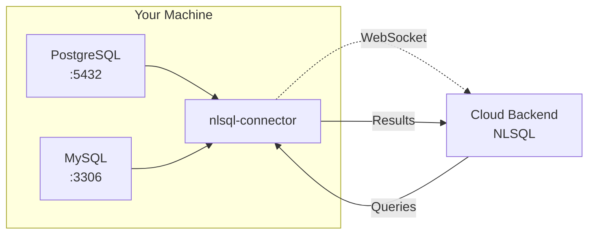
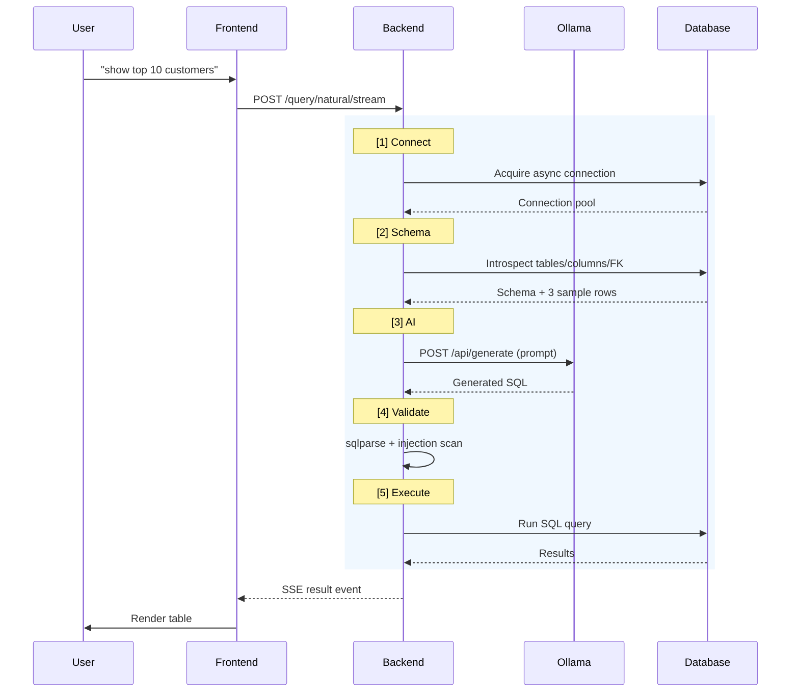

# Natural Language SQL Engine

> Ask your database questions in plain English. Get SQL and results instantly — all AI runs locally via Ollama, no API keys, no cloud costs.

[](https://python.org)
[](https://fastapi.tiangolo.com)
[](https://react.dev)
[](LICENSE)

---

## What it does

Type a question like *"show me the top 10 customers by revenue last month"* — the engine generates SQL, validates it, executes it against your database, and streams results back in real time. No SQL knowledge required.

**Stack:** FastAPI + SQLAlchemy async (backend) · React 18 + Vite + Tailwind (frontend) · Ollama CLI (local AI)

---

## Features

- **Local AI only** — Ollama runs on your machine. No OpenAI, no Anthropic, no data leaves your network.
- **PostgreSQL & MySQL** — Connect multiple databases simultaneously, switch between them in one click.
- **Multi-DB fan-out** — Run the same query across several databases in parallel and merge results.
- **Real-time streaming** — SSE pipeline shows live progress: Connect → Schema → AI → Validate → Execute.
- **Editable SQL preview** — Review and edit AI-generated SQL before running it.
- **Write operations** — INSERT, UPDATE, DELETE with warning banners before execution.
- **Sortable, paginated results** — Click column headers to sort; 50 rows per page for large result sets.
- **Export** — Download results as CSV or JSON, or copy as tab-separated for spreadsheets.
- **Query history** — Every query saved for the session with SQL, explanation, row count, and timing.
- **Encrypted credentials** — Database passwords stored with Fernet encryption in `~/.nlsql/databases.json`.
- **Schema-aware AI** — Prompt includes CREATE TABLE statements, foreign key relationships, and 3 sample rows per table for accurate SQL generation.
- **Connect local databases** — Use `nlsql-connector` to expose your local Postgres/MySQL to the cloud backend (see below).

---

## Connect Local Databases (Tunnel)

You can connect your local databases running on `localhost` to a cloud-deployed NLSQL backend. This is useful when:

- Backend is deployed (e.g., on Render)
- Database is on your local machine (behind firewall/router)

### How It Works



The `nlsql-connector` runs on your machine, auto-discovers local databases, and creates a secure WebSocket tunnel to the backend.

### Step-by-Step

1. **Open NLSQL in your browser** (e.g., https://your-nlsql-deployment.onrender.com)
2. **Click the "Connect" button** in the header
3. **Copy the key** shown (e.g., `nlsql_key_xxx`)
4. **Install and run the connector** on your machine:

```bash
# Install
pip install nlsql-connector

# Run with your key
nlsql-connector --key nlsql_key_xxx
```

5. **Your local databases appear** in the sidebar — select one and start querying!

### Options

| Flag | Description |
|------|-------------|
| `--key, -k` | **Required** — Tunnel key from frontend |
| `--url, -u` | Backend URL (default: your deployed URL) |
| `--verbose, -v` | Debug output |
| `--no-discover` | Skip auto-discovery, use defaults |

### Key Behavior

- **Same key persists** — If you close the browser and come back, the same key reconnects automatically
- **Force close** — If you crash or force-quit the connector, the key is invalidated (regenerate from frontend)
- **Multiple machines** — You can run connectors on multiple machines; each gets its own key; all databases appear in the sidebar

### Troubleshooting

- **"Failed to connect"** — Check your network, verify the backend URL is correct
- **"Registration failed"** — The key may have expired; generate a new one from the frontend
- **"No databases discovered"** — Use `--no-discover` to use default config, or ensure PostgreSQL/MySQL is running on localhost

---

## Prerequisites

- **Python 3.12+**
- **Node.js 18+**
- **Ollama CLI** — [install.ollama.ai](https://ollama.ai)

---

## Quick Start

```bash
# 1. Clone
git clone https://github.com/jmanoj0905/natural-language-sql
cd natural-language-sql

# 2. Install everything (Python venv, Node deps, Ollama model)
./install.sh

# 3. Start
./run.sh dev
```

Open **http://localhost:3000**, connect a database from the sidebar, and start asking questions.

| Service | URL |
|---------|-----|
| Frontend | http://localhost:3000 |
| Backend API | http://localhost:8000 |
| API Docs | http://localhost:8000/docs |
| Ollama | http://localhost:11434 |

---

## Management Commands

```bash
./run.sh dev           # Start backend + frontend + Ollama
./run.sh stop          # Stop all services
./run.sh prod          # Backend only (no frontend dev server)
./run.sh setup-ollama  # Pull/re-pull the AI model
./run.sh clean         # Remove logs and cache
./run.sh logs          # Tail application logs
```

---

## Configuration

All configuration is via environment variables in `.env` (copy from `.env.example`):

| Variable | Default | Description |
|----------|---------|-------------|
| `OLLAMA_MODEL` | `mannix/defog-llama3-sqlcoder-8b` | AI model (SQL-specialist) |
| `OLLAMA_BASE_URL` | `http://localhost:11434` | Ollama endpoint |
| `OLLAMA_TEMPERATURE` | `0.1` | 0 = deterministic, 2 = creative |
| `MAX_QUERY_RESULTS` | `1000` | Hard cap on rows returned |
| `DEFAULT_QUERY_LIMIT` | `100` | Auto-added LIMIT for SELECT queries |
| `QUERY_TIMEOUT_SECONDS` | `30` | Per-query execution timeout |
| `DB_ENCRYPTION_KEY` | *(auto-generated)* | Fernet key for password storage |
| `STRICT_SQL_VALIDATION` | `false` | Block comments and edge-case patterns |
| `SCHEMA_CACHE_TTL_SECONDS` | `3600` | Schema cache lifetime (1 hour) |
| `LOG_LEVEL` | `INFO` | DEBUG / INFO / WARNING / ERROR |

### Switching AI Models

The default model (`mannix/defog-llama3-sqlcoder-8b`) is fine-tuned for SQL generation. To use a different model:

```bash
ollama pull <model-name>
# Update OLLAMA_MODEL in .env
./run.sh stop && ./run.sh dev
```

| Model | Size | Notes |
|-------|------|-------|
| `mannix/defog-llama3-sqlcoder-8b` | ~5GB | Default — SQL-specialist, highest accuracy |
| `sqlcoder:7b` | ~4GB | Alternative SQL-specialist |
| `llama3.2:3b` | ~2GB | Faster, less accurate |
| `codellama:7b` | ~3.8GB | General code model |

---

## API Reference

All endpoints are under `/api/v1`.

### Query

```bash
# Natural language → SQL → execute (SSE streaming, preferred)
curl -X POST http://localhost:8000/api/v1/query/natural/stream?database_id=mydb \
  -H "Content-Type: application/json" \
  -d '{"question": "show top 10 customers by revenue", "options": {"execute": true}}'

# Multi-DB fan-out (same SQL against multiple databases in parallel)
curl -X POST "http://localhost:8000/api/v1/query/natural/stream?database_ids=db1,db2,db3" \
  -H "Content-Type: application/json" \
  -d '{"question": "count active users", "options": {"execute": true}}'

# Execute raw SQL directly
curl -X POST http://localhost:8000/api/v1/query/sql?database_id=mydb \
  -H "Content-Type: application/json" \
  -d '{"sql": "SELECT * FROM users LIMIT 10"}'
```

### Databases

```bash
# Register a database
curl -X POST http://localhost:8000/api/v1/databases \
  -H "Content-Type: application/json" \
  -d '{"database_id":"mydb","db_type":"postgresql","host":"localhost","port":5432,"database":"mydb","username":"user","password":"pass"}'

# List all databases
curl http://localhost:8000/api/v1/databases

# Test connection without registering
curl -X POST http://localhost:8000/api/v1/databases/test \
  -H "Content-Type: application/json" \
  -d '{"db_type":"mysql","host":"localhost","port":3306,"database":"mydb","username":"root","password":"pass"}'
```

### Schema

```bash
# Get schema for a database
curl "http://localhost:8000/api/v1/schema?database_id=mydb"

# Clear schema cache (after migrations)
curl -X POST http://localhost:8000/api/v1/schema/cache/clear
```

### Tunnel (Local Database Connector)

```bash
# Generate a new tunnel key (from frontend)
curl -X POST http://localhost:8000/api/v1/tunnel/generate-key

# Get connected machines status
curl http://localhost:8000/api/v1/tunnel/status

# Get available tunnel databases
curl http://localhost:8000/api/v1/tunnel/available-databases

# Send heartbeat (keeps key valid after browser close)
curl -X POST http://localhost:8000/api/v1/tunnel/heartbeat \
  -H "Content-Type: application/json" \
  -d '{"key": "nlsql_key_xxx"}'

# Graceful disconnect (key remains valid)
curl -X POST http://localhost:8000/api/v1/tunnel/disconnect \
  -H "Content-Type: application/json" \
  -d '{"key": "nlsql_key_xxx"}'
```

---

## Project Structure

```
natural-lang-sql/
├── app/                              # FastAPI backend
│   ├── main.py                       # Entry point, CORS, exception handlers
│   ├── config.py                     # All settings (env vars via Pydantic)
│   ├── exceptions.py                 # Exception hierarchy
│   ├── api/v1/endpoints/
│   │   ├── query.py                  # /query/natural, /query/sql
│   │   ├── query_stream.py           # /query/natural/stream (SSE)
│   │   ├── schema.py                 # /schema endpoints
│   │   ├── database.py               # /databases CRUD
│   │   ├── tunnel.py                 # /tunnel endpoints (WebSocket)
│   │   └── health.py                 # /health endpoints
│   └── core/
│       ├── ai/
│       │   ├── ollama_client.py      # httpx client for Ollama /api/generate
│       │   ├── ollama_sql_generator.py
│       │   └── prompts.py            # Prompt templates + SQL/explanation extraction
│       ├── database/
│       │   ├── connection_manager.py # Engine pool, Fernet-encrypted credentials
│       │   ├── schema_inspector.py   # Schema introspection with TTL cache
│       │   └── adapters/             # PostgreSQL + MySQL adapters
│       ├── tunnel/                   # Local database connector support
│       │   ├── key_manager.py        # Tunnel key generation/validation
│       │   ├── registry.py           # Machine connection state
│       │   └── query_router.py       # Route queries to correct machine
│       ├── query/
│       │   ├── validator.py          # SQL validation, LIMIT enforcement
│       │   └── executor.py           # Async execution with timeout
│       └── security/
│           └── sql_sanitizer.py      # SQL injection pattern blocking
├── frontend/                         # React 18 + Vite SPA
│   └── src/
│       ├── App.jsx                   # Top nav, sidebar, tab routing
│       ├── config.js                 # Shared API_BASE + tunnel endpoints
│       ├── components/
│       │   ├── AppSidebar.jsx        # DB list, connect/edit/delete modals
│       │   ├── QueryInterface.jsx    # NL input, SSE streaming, SQL preview
│       │   ├── ResultsDisplay.jsx    # Sortable table, pagination, export
│       │   ├── QueryHistory.jsx      # Session query history
│       │   ├── QueryProgress.jsx    # 5-stage pipeline indicator
│       │   ├── ConnectTunnelModal.jsx # Tunnel key generation UI
│       │   └── TunnelStatus.jsx      # Connected machines display
│       └── utils/
│           └── sql.js                # detectWriteOp utility
├── connector/                        # nlsql-connector (local DB tunnel agent)
│   ├── nlsql_connector/
│   │   ├── main.py                  # CLI entry point
│   │   ├── discoverer.py            # Auto-discover local Postgres/MySQL
│   │   └── tunnel.py                 # WebSocket client + query proxy
│   └── pyproject.toml               # Package config
├── tests/                            # pytest test suite
├── requirements.txt
├── install.sh                        # One-command setup
└── run.sh                            # Dev/prod/stop/clean/logs
```

---

## How it Works



User question → Frontend sends to Backend → Backend connects to DB → Fetches schema → Sends to Ollama → Validates SQL → Executes → Returns results via SSE → Frontend renders.

---

## Security Notes

- **Credentials** are Fernet-encrypted at rest in `~/.nlsql/databases.json`. Generate a stable key and set `DB_ENCRYPTION_KEY` in `.env` — otherwise a new key is generated on each restart, making saved passwords unrecoverable.
- **SQL injection** is blocked by a pattern sanitizer before execution. Enable `STRICT_SQL_VALIDATION=true` for stricter rules.
- **Write operations** (INSERT/UPDATE/DELETE) are unrestricted by default. The UI shows warning banners; use a read-only DB user if you want a hard block.
- **CORS** defaults to `http://localhost:3000`. Set `CORS_ORIGINS` for production.

```bash
# Generate a stable encryption key
python -c "from cryptography.fernet import Fernet; print(Fernet.generate_key().decode())"
# Add to .env → DB_ENCRYPTION_KEY=<key>
```

---

## Development

```bash
# Backend only
source .venv/bin/activate
uvicorn app.main:app --reload --port 8000

# Frontend only
cd frontend && npm run dev

# Run tests
.venv/bin/python -m pytest tests/ -v
```

---

## License

GPL-3.0 — see [LICENSE](LICENSE) for details.

**Author:** Manoj J · [jmanoj.pages.dev](https://jmanoj.pages.dev) · [github.com/jmanoj0905](https://github.com/jmanoj0905)
